[](https://claude.com/claude-code)
[](https://loophole.company/)

<p align="center">
  
</p>

<h1 align="center">Bastillion</h1>
<p align="center"><strong>A modern, web-based SSH console and SSH key management tool.</strong></p>

Bastillion gives you a clean, browser-based way to manage SSH access across all your
systems — like a bastion host with a friendly dashboard. It does two things:

1. **Web-based SSH terminal** — once a host is registered, authorized users can open one or
   more live terminal sessions to it directly from the browser, with commands optionally
   broadcast across every open session at once (think tmux's synchronized panes, but for a
   fleet of remote hosts instead of local panes).

2. **SSH key management** — Bastillion holds its own SSH keypair and pushes/rotates public
      keys across the hosts you register, so individual users never need to hold or manage
      long-lived keys to those systems themselves.

- Log in with **2-factor authentication** (Authy or Google Authenticator)
- Manage and distribute **SSH public keys**, and disable/rotate them centrally
- Launch secure multi-session web shells and **share commands** across sessions
- **Record every session** and replay it on demand — audit-ready evidence for any compliance framework
- Group systems into **Profiles** and control exactly who can reach what
- Save and re-run **Composite Scripts** across a whole fleet at once
- Stack **TLS/SSL over SSH** for extra protection

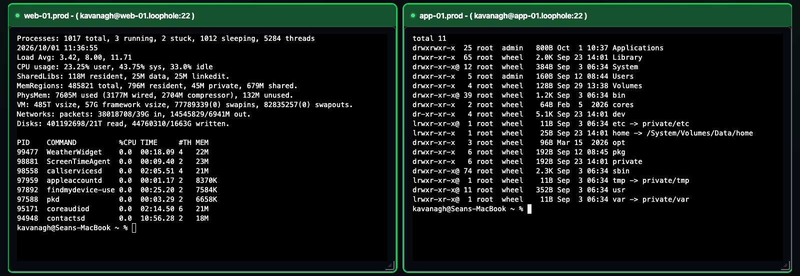
<p align="center"><sub>Two live SSH sessions to the existing web and application example hosts.</sub></p>

---

## Contents

- [How It Works](#how-it-works)
- [What's New](#-whats-new)
- [Licensing](#licensing)
- [Installation Options](#installation-options)
- [Prerequisites](#prerequisites)
- [Download and Run](#download-and-run)
- [Build from Source](#build-from-source)
- [TLS / HTTPS](#tls--https)
- [Configuration](#configuration)
- [More Screenshots](#more-screenshots)
- [License](#license)

---

## How It Works

Bastillion sits between your users and the systems they need to reach, acting as a trusted
third party rather than a simple password vault. Here's the whole lifecycle, end to end.

### 1. Bastillion generates its own SSH keypair

On first startup, before anything else, Bastillion generates an Ed25519 keypair for
itself — this is the *one* key that ever gets pushed to your hosts. It's shown in the
console output and always visible under **Settings**.

### 2. Register a system

An admin adds a host under **Manage → Systems** (user, host, port, and the path to that
host's `authorized_keys` file). Bastillion authenticates **once** with a password or
passphrase you supply, then pushes its own public key into that host's `authorized_keys`.
From then on it connects using that key — no stored passwords, ever. Status flips to
**Success** the moment the key is in place.

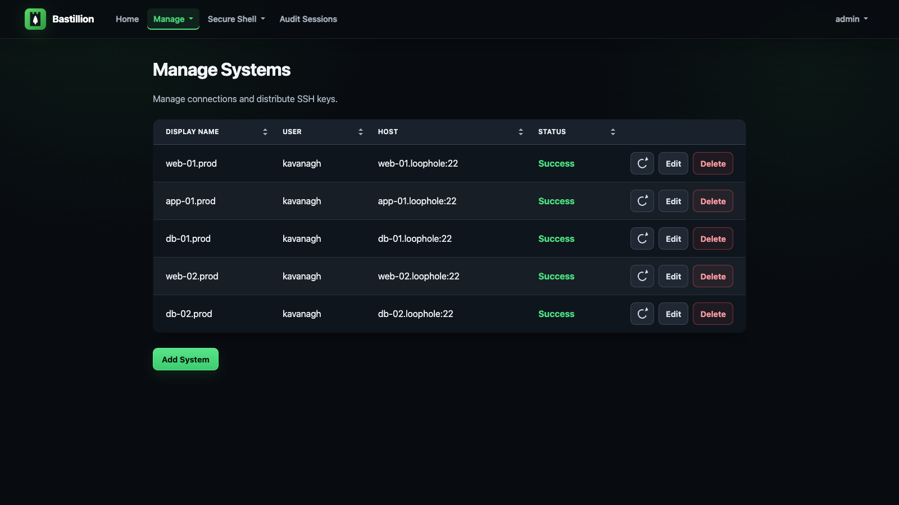

### 3. Group systems into Profiles, assign Users

Systems get grouped into named **Profiles** — think "Production," "Staging," "Database
Tier." Users are then linked to profiles under **Manage → Users**, which is the only thing
that controls who can reach what. Revoke a profile assignment and that access is gone
immediately, no key rotation needed.

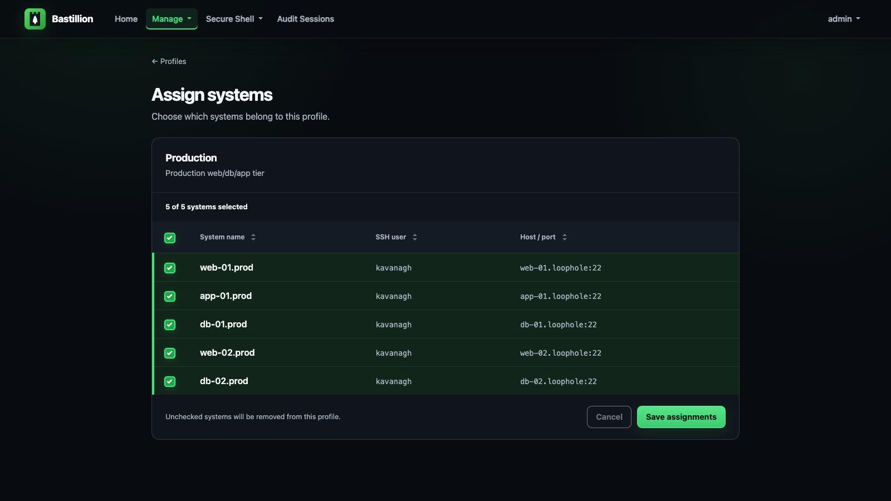

### 4. Open terminals — and broadcast to all of them at once

Assigned users open **Secure Shell → Terminals**, pick one or more systems, and get live,
resizable, xterm-based terminals in the browser, side by side. Type once, and it goes to
every terminal marked active — the same keystroke, the same command, the same output shape,
across as many hosts as you selected.


### 5. Rotate or revoke keys centrally

Because every host trusts the *same* application key (not one key per user), disabling it
once under **Manage SSH Keys** revokes access everywhere immediately — no need to touch
target systems by hand, no hunting down which server has which stale key.

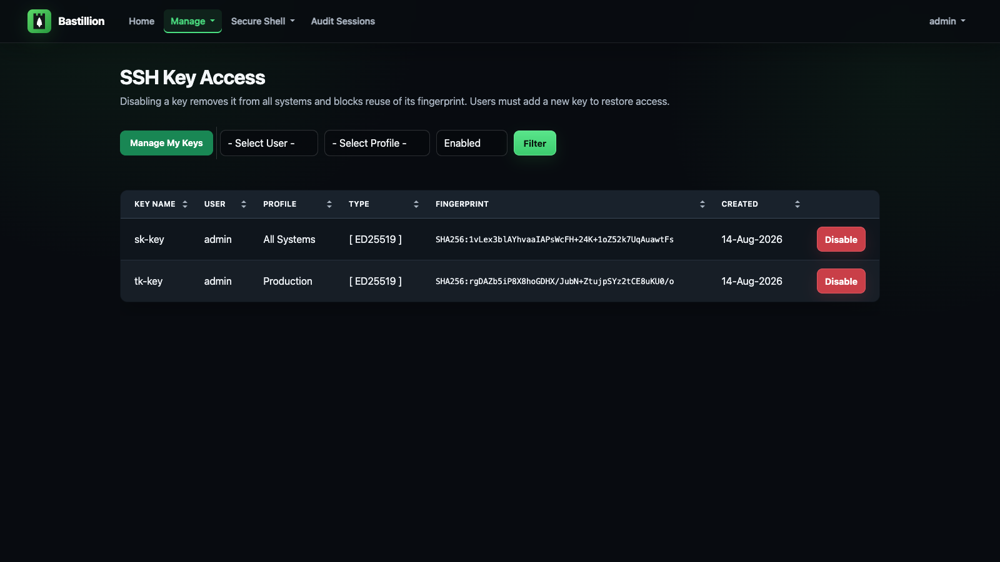

### 6. Verify the host is who it claims to be

Every connection checks the host key the target system presents against the one Bastillion
recorded for it. The first time a host is seen, its key is recorded and trusted; if that key
later changes, the connection is **refused** and the system appears under **Manage → Host
Keys** as *changed — blocked*, showing the approved fingerprint and the offered one together
so you can tell a rebuilt host from an intercepted connection. Trusting the new key is a
deliberate, logged act.

This matters more for a bastion than for a laptop. Bastillion hands the target system its
private key, and on authentication fallback the password or passphrase you supplied — so
anything that can answer on a managed system's address collects credentials for it. Until
this check existed, nothing compared that key against anything.

Set `hostKeyVerification=strict` to also require a manager to approve each newly seen host
before the first connection to it, or `off` to restore the old behaviour — see
[Configuration](#configuration).

### 7. Every session is recorded — audit and replay

Everything typed and every byte returned in those terminals is recorded automatically.
Managers open **Audit Sessions**, filter by user or system, and replay any session —
side by side for sessions that spanned multiple hosts, with a text filter to jump
straight to the lines that matter. Output **streams** into the page as it loads, so even
a session that dumped hundreds of megabytes of logs replays without breaking a sweat.

If you need to show an auditor who ran what, where, and when — this is that evidence,
captured out of the box. Practically every compliance framework has a privileged-access
audit-trail requirement somewhere (PCI DSS, HIPAA, SOC 2, ISO 27001 — pick yours), and
this checks that box without a commercial PAM product. Sessions are kept for 90 days by
default (`deleteAuditLogAfter`), and recording can be switched off with
`ENABLE_INTERNAL_AUDIT=false` — see [Auditing](#configuration).

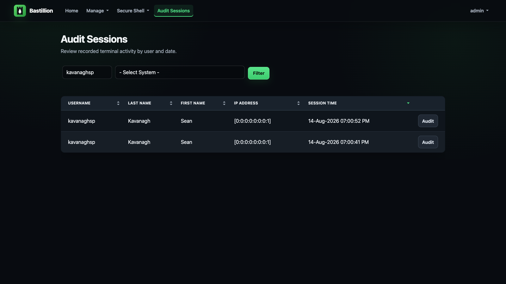

---

## 🚀 What's New
- **SSH host key verification** — the key each managed system presents is recorded on first
  sight and checked on every connection after it; a changed key blocks the connection and
  surfaces under **Manage → Host Keys** for a manager to resolve. On by default
  (`hostKeyVerification=accept-new`) — see [How It Works](#6-verify-the-host-is-who-it-claims-to-be)
- **SSH certificate authentication** (optional) — Bastillion can sign a short-lived
  certificate per connection instead of relying on its public key being in each host's
  `authorized_keys`, which also puts the Bastillion username in the target host's own auth
  log. Off by default; needs each host configured to trust the CA — see [Configuration](#configuration)
- **SAML 2.0 SSO** — sign in via an enterprise IdP (Entra ID, Okta, ADFS, and others) — see [Configuration](#configuration)
- **Licensing** — free at up to 8 systems, paid tiers available at [loophole.company/pricing.html](https://loophole.company/pricing.html) (see [Licensing](#licensing) below)
- **Session audit & replay, on by default** — every terminal session is recorded and can be replayed under **Audit Sessions**, streamed to the browser so even huge sessions load instantly
- Runs as a **self-contained jar** (`java -jar`) with HTTPS out of the box — see [Download and Run](#download-and-run)
- Upgraded to **Java 21**, **Jetty 12**, and **Jakarta EE 10**
- Full support for **Ed25519** (default) and **Ed448** SSH keys
- **v4 → v5 migration tool** to bring over users, systems, keys, and audit logs from an existing instance — see [`tools/migrate`](tools/migrate/README.md)
- Hardened with a **CSRF filter** and app-wide **security headers**

---

## Licensing

Bastillion runs unlicensed at up to **8 registered systems** — enough to try it for real
before buying. A license raises that cap.

1. Buy a license at **[loophole.company/pricing.html](https://loophole.company/pricing.html)**
   (Starter/Team/Business — priced by system count). Payment redirects back and downloads a
   `.lic` file automatically.
2. Open the `.lic` file and copy its contents (one line).
3. Set it via the `LICENSE_KEY` environment variable:
   ```bash
   export LICENSE_KEY=<paste license file contents here>
   ```
   or paste it into `licenseKey` in `BastillionConfig.properties` instead — the environment
   variable takes precedence if both are set.
4. Restart Bastillion. **Settings** shows the licensee, system cap, and expiry, with a
   warning starting 90 days before it expires.

Licenses are annual and don't auto-renew — no card kept on file. Buy again from the same
pricing page when you get the expiry warning.

---

## Installation Options
**Free:** https://github.com/Loophole-LLC/Bastillion/releases

---

## Prerequisites

### Java 21 (OpenJDK)
```bash
apt-get install openjdk-21-jdk
```

### Authenticator (for 2FA)

| Application | Android | iOS |
|--------------|----------|-----|
| **Authy** | [Google Play](https://play.google.com/store/apps/details?id=com.authy.authy) | [iTunes](https://itunes.apple.com/us/app/authy/id494168017) |
| **Google Authenticator** | [Google Play](https://play.google.com/store/apps/details?id=com.google.android.apps.authenticator2) | [iTunes](https://itunes.apple.com/us/app/google-authenticator/id388497605) |

---

## Download and Run

Download the latest jar from [Releases](https://github.com/Loophole-LLC/Bastillion/releases):
```bash
java -jar bastillion-<version>.jar
```

Access in browser: `https://<server-ip>:8443` — see [TLS / HTTPS](#tls--https) below for the
self-signed certificate Bastillion generates on first run.

Default credentials:
```
username: admin
password: changeme
```

Runs in the foreground; stop with Ctrl+C. For background/daemon operation use whatever your
platform normally uses for a long-running Java process — `nohup java -jar ... &`, a systemd
unit, a container, etc.

---

## Build from Source

Install Maven 3+:
```bash
apt-get install maven
```

Build and run (packages a self-contained jar with an embedded Jetty server — see
`io.bastillion.Main` — and runs it):
```bash
mvn package
java -jar target/bastillion-5.0.0-SNAPSHOT.jar
```

Or for local dev without repackaging on every change:

```bash
mvn compile exec:java
```

For an isolated local UI review, keep test data in a separate directory and generate the
database password automatically on first startup:

```bash
CONFIG_DIR=/tmp/bastillion-ui-review/ TLS_ENABLED=false PORT=8080 \
  mvn -DGEN_DB_PASS=true compile exec:java
```

Open `http://localhost:8080` and sign in with the default credentials above. This HTTP
configuration is for local development. For deployment, use HTTPS as described below.
HTML, CSS, and JavaScript are served from `target/classes/webapp`; after editing files
under `src/main/webapp`, run `mvn resources:resources` and reload the browser to see changes. Templates are cached for up to 60 seconds;
restart the development process to clear that cache immediately.

Listens on `https://localhost:8443` by default, same as the downloaded release above — see
[TLS / HTTPS](#tls--https) below for how that certificate gets set up and how to use your
own instead.

---

## TLS / HTTPS

Bastillion generates its own self-signed certificate on first startup and serves HTTPS —
nothing to configure. Browsers will show a warning once (it's self-signed, not issued by a
CA); click through it, same as you would for any other self-hosted appliance. The
certificate and its password persist across restarts (`keystore/bastillion.p12` under
[`CONFIG_DIR`](#configuration), password stored the same encrypted way as the database
password).

**Use your own CA-signed certificate** instead of the self-signed default — e.g. a free one
from [Let's Encrypt](https://letsencrypt.org/):

1. Issue the certificate with [certbot](https://certbot.eff.org/) (requires a real DNS name
   pointing at this host, and port 80 reachable for the HTTP-01 challenge):
   ```bash
   sudo certbot certonly --standalone -d bastillion.example.com
   ```
   This writes `fullchain.pem` and `privkey.pem` to
   `/etc/letsencrypt/live/bastillion.example.com/`.

2. Convert the cert/key pair to PKCS12, the keystore format Bastillion expects:
   ```bash
   openssl pkcs12 -export \
     -in /etc/letsencrypt/live/bastillion.example.com/fullchain.pem \
     -inkey /etc/letsencrypt/live/bastillion.example.com/privkey.pem \
     -out bastillion.p12 -name bastillion -passout pass:changeit
   ```

3. Point Bastillion at it and restart:
   ```bash
   export KEYSTORE_PATH=/path/to/bastillion.p12
   export KEYSTORE_PASSWORD=changeit
   ```
   Browsers will now trust the connection with no warning. Let's Encrypt certificates expire
   every 90 days — `certbot renew` followed by re-running steps 2–3 (and a restart) keeps it
   current; `certbot renew --deploy-hook` can automate that.

**Behind a reverse proxy or load balancer that already terminates TLS** (nginx, Cloud
Run, etc.) — disable Bastillion's own HTTPS and let it serve plain HTTP instead:
```bash
export TLS_ENABLED=false
```
Defaults to port 8080 in this mode; set `PORT` to change it.

---

## Configuration

Every setting below can be set as an **environment variable** — take the property name and
insert an underscore before each capital letter that follows a lowercase letter or digit,
then uppercase it: `licenseKey` → `LICENSE_KEY`, `dbUser` → `DB_USER`, `sshKeyType` →
`SSH_KEY_TYPE`. This is the recommended way to configure Bastillion, especially in
containers — no file to mount or bake in.

Note the "follows a lowercase letter or digit" part: a run of capitals stays together, so
`clientIPHeader` → `CLIENT_IPHEADER` (not `CLIENT_IP_HEADER`) and `maxLoginAttemptsPerIP` →
`MAX_LOGIN_ATTEMPTS_PER_IP`. Each block below spells out the variable for every setting, so
you shouldn't need to apply the rule by hand.

`BastillionConfig.properties` still works as a fallback (env vars always win if both are
set), and is where any value Bastillion generates for you at first startup — like a random
DB password — gets persisted. See `src/main/resources/BastillionConfig.properties` for the
full list of settings and their defaults.

**Consolidating everything under one directory** (e.g. a single Docker volume mount):
`CONFIG_DIR` is the one setting to reach for. Everything Bastillion persists —
`BastillionConfig.properties`, the self-signed TLS keystore (`keystore/bastillion.p12`), the
H2 database and the SSH host key pair (both under `keydb/`), and `bastillion.jceks` — lives
under it by default, so pointing `CONFIG_DIR` at one place relocates all of it:
```bash
export CONFIG_DIR=/data/bastillion/
```
`KEYSTORE_PATH` and `DB_CONNECTION_URL` still exist for pointing just one of those at a
different location on its own (a real cert, a remote DB) — see [TLS / HTTPS](#tls--https) and
the "Database Settings" section below — but neither is needed just to consolidate everything
into `CONFIG_DIR`.

`CONFIG_DIR` itself defaults to `./config` relative to the working directory. Upgrading an
existing instance that never set it? Older releases stored state directly in the working
directory instead of `./config` — Bastillion detects that on first startup with this version
and moves it into `./config` (or into `CONFIG_DIR`, if you've now set one) automatically.

<details>
<summary><strong>SSH Key Management</strong></summary>

How much of each managed system's `authorized_keys` file Bastillion takes responsibility for:

```bash
# manage (default) - Bastillion owns the file: it is replaced with the public keys of every
#                    user assigned to that system, plus Bastillion's own. Revoking a user's
#                    key removes their direct access to the host on the next refresh.
# append           - leave the file alone except for making sure Bastillion's own key is in
#                    it. User keys are not distributed.
# off              - never read or write the file at all.
export KEY_MANAGEMENT=manage

# authorized_keys refresh interval in minutes (no refresh for <=0)
export AUTH_KEYS_REFRESH_INTERVAL=120

# Force user key generation and strong passphrases
export FORCE_USER_KEY_GENERATION=false
```

`off` is only usable when Bastillion can authenticate some other way — in practice
`sshCertificateAuth=on` with the authority installed on every host, since otherwise there is
nothing for it to log in with. Bastillion warns loudly at startup if both are off. It also
gives up the fallback: with no application key on the host, a certificate problem locks
Bastillion out of that system instead of degrading to key authentication.

In `append` and `off` the refresh timer and the **Manage SSH Keys** screens are hidden —
there is nothing left for them to distribute.

> The older boolean `KEY_MANAGEMENT_ENABLED` still works and is honoured when `KEY_MANAGEMENT`
> is unset (`true` → `manage`, `false` → `append`), so an existing instance keeps the
> behaviour it had. Prefer `KEY_MANAGEMENT` in new setups.
</details>

<details>
<summary><strong>Custom SSH Key Pair</strong></summary>

By default Bastillion generates its own Ed25519 keypair on first startup. To use your own
instead, the easiest way is through the UI: **Settings → Replace Application SSH Key**
(manager accounts only) — paste in a private key, public key, and passphrase if it has one,
and it takes effect immediately, no restart needed.

⚠️ This replaces the *one* key every registered system trusts. It's meant as a one-time step
when first setting up Bastillion, **before** you've registered any systems — if you already
have systems registered, Bastillion loses SSH access to all of them the instant you replace
the key, unless this exact key is already sitting in `authorized_keys` on every one of them
first. The Settings page requires an extra confirmation checkbox once you have systems
registered, precisely because of this.

**Already have systems registered and need to rotate the key anyway?** Pre-stage the new key
through Bastillion itself rather than editing `authorized_keys` by hand everywhere:

1. Set `FORCE_USER_KEY_GENERATION=false` so **Manage SSH Keys → Add SSH Key** lets you paste
   an existing public key instead of only generating a new one.
2. Add the new key there against a profile covering all your systems, and confirm (under
   Manage SSH Keys, or each system's status) that it's actually landed everywhere — keep
   `AUTH_KEYS_REFRESH_INTERVAL` in mind, since that's what pushes it out.
3. Only once you're sure it's on every system, replace the application key in Settings.
4. Set `FORCE_USER_KEY_GENERATION` back to its previous value, then once you've confirmed
   the new application key has propagated to every system (again, mind
   `AUTH_KEYS_REFRESH_INTERVAL`), remove the key you added in step 2 from Manage SSH Keys —
   it was only staged there to pre-seed `authorized_keys` and isn't needed going forward.

For scripted/headless setups, the same thing can be done via environment variables and a
restart instead:

```bash
# Regenerate and import SSH keys
export RESET_APPLICATION_SSH_KEY=true

# Private key
export PRIVATE_KEY=/Users/you/.ssh/id_rsa

# Public key
export PUBLIC_KEY=/Users/you/.ssh/id_rsa.pub

# Passphrase (leave blank if none)
export DEFAULT_SSH_PASSPHRASE=myPa$$w0rd
```

Once registered, you can drop these — the key pair is already stored in the database.

`SSH_KEY_TYPE` (`rsa`, `ecdsa`, `ed25519`, or `ed448`) only matters when Bastillion is
*generating* a fresh key, not when importing one — the type of an imported key is read from
the key itself:
```bash
# SSH key type ('rsa', 'ecdsa', 'ed25519', or 'ed448')
# Supported options:
#   rsa    - Classic, widely compatible (configurable length, default 4096)
#   ecdsa  - Faster, smaller keys (P-256/384/521 curves)
#   ed25519 - Default and recommended (≈ RSA-4096, secure and fast)
#   ed448  - Extra-strong (≈ RSA-8192, slower and less supported)
export SSH_KEY_TYPE=ed25519
```
</details>

<details>
<summary><strong>SSH Host Key Verification</strong></summary>

Controls what happens when a managed system presents an SSH host key. Recorded keys are
reviewed under **Manage → Host Keys**, where a changed or newly seen key can be trusted,
revoked, or forgotten.

```bash
# accept-new (default) - record and trust each host's key the first time it is seen, then
#                        refuse to connect if that host ever presents a different one
# strict               - as accept-new, but a newly seen host key must also be approved by a
#                        manager before the first connection to that host is allowed
# off                  - no host key verification at all (the behaviour before 6.0.0)
export HOST_KEY_VERIFICATION=accept-new
```

`accept-new` is the default so that upgrading an existing instance needs no action: each
host's key is recorded on its next connection, rather than every connection being refused
until a manager has approved every host. It still catches the case that matters — a key that
changes underneath you.

Host key decisions are written to the `io.bastillion.manage.util.SystemAudit` log — which
host keys were trusted on first sight, and which connections were refused.
</details>

<details>
<summary><strong>SSH Certificate Authentication</strong></summary>

By default Bastillion authenticates to each system with its own public key, which has to be
present in that system's `authorized_keys` (see [How It Works](#2-register-a-system)).
Instead, it can sign a short-lived SSH certificate per connection:

```bash
# off (default) - authenticate with the application key
# on            - sign a certificate per connection and authenticate with that
export SSH_CERTIFICATE_AUTH=on

# How long an issued certificate stays valid (seconds). Short on purpose: a leaked
# certificate stops working on its own rather than needing to be revoked.
export SSH_CERTIFICATE_VALIDITY_SECONDS=300
```

**Each managed system has to be told to trust the authority** before it will accept a
certificate. Bastillion generates its own Ed25519 certificate authority on first startup and
prints the public key to the console; **Settings** shows it too, with these steps, a copy
button and a `bastillion_ca.pub` download. On each host, as root:

```bash
cp bastillion_ca.pub /etc/ssh/bastillion_ca.pub
echo 'TrustedUserCAKeys /etc/ssh/bastillion_ca.pub' >> /etc/ssh/sshd_config
systemctl reload sshd
```

You can do this host by host after switching certificates on, rather than all of it first.
The application key is still offered behind the certificate, so a host that does not trust
the CA yet keeps authenticating exactly as it did before — provided key management is still
leaving that key in its `authorized_keys`. The **Auth** column on the systems screen shows
which of the two each host actually accepted, so you can watch a rollout land.

⚠️ That needs **root on each host**, which pushing to `authorized_keys` does not. This is an
alternative to key distribution for fleets you configure centrally, not a drop-in
replacement for it — which is why it is off by default.

**This does not turn off key management, and usually shouldn't.** The two settings control
different things: `sshCertificateAuth` is how *Bastillion* authenticates to a host, while
`keyManagement` is how much of that host's `authorized_keys` Bastillion maintains. See
[SSH Key Management](#configuration).

**The usual pairing is `KEY_MANAGEMENT=append`.** That keeps Bastillion's own key in
`authorized_keys` as a fallback while leaving the rest of the file alone — so you get
certificate authentication and per-user attribution without Bastillion rewriting user keys on
every host.

`KEY_MANAGEMENT=off` is the stricter option, for when you want Bastillion provably not
touching the file at all. What it costs is the fallback: with no application key on the host,
a certificate authority problem becomes a lockout from that system rather than a logged
degradation to key authentication.

Two things worth being clear about, because it is easy to credit them to certificates:

- **Distributing users' keys is a `keyManagement` choice, not a certificate one.** Only
  `manage` distributes them; `append` never has, long before certificates existed. If your
  engineers rely on Bastillion placing their keys for direct access, stay on `manage` —
  turning certificates on does not affect that either way.
- **`off` does not stop direct SSH.** Keys already on a host, however they got there, keep
  working. It stops Bastillion *maintaining* the file.

**Users can download a certificate for their own SSH client** from **Manage SSH Keys**, next
to each of their keys, once this is on. It is signed for that key, carries the login accounts
their profiles currently reach, and lets them `ssh` to a host directly with nothing in its
`authorized_keys`. It downloads as `<key name>.key-cert.pub`, which is what OpenSSH looks for
beside the `<key name>.key` private key from the same screen — keep both names as given and
`ssh -i <key name>.key` picks the certificate up on its own.

```bash
export SSH_USER_CERTIFICATE_VALIDITY_SECONDS=28800   # 8 hours
```

The default is one working session, which is deliberate. The principals are read **at issue
time**, so re-downloading is what re-checks the user's entitlements — that is the only thing
making expiry stand in for revocation, since nothing here publishes a revocation list.
Bastillion warns at startup above 12 hours. Two consequences worth stating plainly:

- Revoking a user's profile **no longer takes effect immediately** for a certificate they
  already hold; it takes effect when that certificate expires.
- Those sessions reach the host directly, so they are **not** in Bastillion's session audit.
  The host's own log records them, with the certificate's key id.

⚠️ **A certificate principal is a username, with no host in it.** A certificate naming
`deploy` is accepted as `deploy@` on *every* host trusting this authority, not only the ones
in that user's profiles. Where hosts share login account names and profiles are what separate
them, that is wider access than the profile grants. To keep per-host scoping, give each host
an `AuthorizedPrincipalsFile` listing which principals it accepts — at the cost of per-host
configuration, which is the thing certificates were adopted to avoid.

What it buys, beyond not distributing keys: Bastillion authenticates to every system with
one shared application key, so a host's own logs cannot tell which Bastillion user was
responsible for a session. Each certificate carries a key id of `bastillion:<username>`,
which sshd records on every accepted connection:

```
Accepted publickey for deploy ... ED25519-CERT SHA256:4P6XvKoX... ID bastillion:alice (serial 7) CA ED25519 SHA256:ztZuuKqR...
```

If signing fails for any reason, Bastillion falls back to plain public key authentication and
logs an error, rather than locking every system out at once.

**Host certificates** work in the other direction: trust a host certificate authority under
**Manage → Host Keys**, and any system presenting a host certificate signed by it is accepted
without its individual host key needing to be recorded or approved — useful for a fleet that
is reprovisioned often.
</details>

<details>
<summary><strong>Web Hardening</strong></summary>

Bastillion sends `Content-Security-Policy`, `X-Content-Type-Options`, `X-Frame-Options`,
`Referrer-Policy` and `Strict-Transport-Security` on every response. HSTS is tunable:

```bash
# How long a browser should refuse plain HTTP to this site (seconds, one year by default)
export HSTS_MAX_AGE=31536000

# Extend that to every subdomain of the host serving Bastillion
export HSTS_INCLUDE_SUB_DOMAINS=false

# Also request inclusion in browsers' built-in HSTS lists (requires the above)
export HSTS_PRELOAD=false
```

`hstsIncludeSubDomains` is off by default because it is not a reversible mistake: a browser
that has cached it refuses plain HTTP to every subdomain of that host for the whole
`hstsMaxAge`. On a dedicated host (`bastillion.example.com`) it affects essentially nothing
and is worth turning on; served from an apex domain it would force HTTPS across every sibling
subdomain. `hstsPreload` is harder still to undo — removal takes months to reach users.

Failed logins are throttled per client IP, deliberately not per account, so nobody can lock
out a known admin username by failing its password on purpose:

```bash
# Failed attempts allowed per client IP within the window below
export MAX_LOGIN_ATTEMPTS_PER_IP=10
export LOGIN_THROTTLE_WINDOW_MINUTES=5

# Ceiling on how many client IPs are tracked at once
export MAX_THROTTLED_IPS=20000

# Header to trust for the client IP (e.g. X-Forwarded-For). Only set this behind a reverse
# proxy that writes the header itself - trusting a client-suppliable header without one lets
# an attacker vary it freely and bypass the throttle.
export CLIENT_IPHEADER=
```
</details>

<details>
<summary><strong>Database Settings</strong></summary>

Embedded H2 example:
```bash
export DB_USER=bastillion
export DB_PASSWORD=p@$$w0rd!!
export DB_DRIVER=org.h2.Driver
export DB_CONNECTION_URL=jdbc:h2:file:keydb/bastillion;CIPHER=AES;
```

Remote H2 example:
```bash
export DB_CONNECTION_URL=jdbc:h2:tcp://<host>:<port>/~/bastillion;CIPHER=AES;
```
</details>

<details>
<summary><strong>External Authentication (LDAP / JAAS)</strong></summary>

Authenticate against an existing LDAP/Active Directory server instead of (or alongside) local
passwords. Enable it:
```bash
export JAAS_MODULE=ldap-ol
```

Configure `jaas.conf`:
```
ldap-ol {
    com.sun.security.auth.module.LdapLoginModule SUFFICIENT
    userProvider="ldap://hostname:389/ou=example,dc=bastillion,dc=com"
    userFilter="(&(uid={USERNAME})(objectClass=inetOrgPerson))"
    authzIdentity="{cn}"
    useSSL=false
    debug=false;
};
```

To map LDAP roles to Bastillion profiles:
```
ldap-ol-with-roles {
    org.eclipse.jetty.security.jaas.spi.LdapLoginModule required
    debug="false"
    useLdaps="false"
    contextFactory="com.sun.jndi.ldap.LdapCtxFactory"
    hostname="<SERVER>"
    port="389"
    bindDn="<BIND-DN>"
    bindPassword="<BIND-DN PASSWORD>"
    authenticationMethod="simple"
    forceBindingLogin="true"
    userBaseDn="ou=users,dc=bastillion,dc=com"
    userRdnAttribute="uid"
    userIdAttribute="uid"
    userPasswordAttribute="userPassword"
    userObjectClass="inetOrgPerson"
    roleBaseDn="ou=groups,dc=bastillion,dc=com"
    roleNameAttribute="cn"
    roleMemberAttribute="member"
    roleObjectClass="groupOfNames";
};
```

Admins are added upon first login and can be assigned system profiles.

**How role mapping actually works:** each LDAP group a user belongs to (per `roleBaseDn`/
`roleMemberAttribute` above) becomes a "role name" - the value of that group's
`roleNameAttribute` (`cn` in the example above). On every login, Bastillion compares each of
those role names, **by exact text match**, against the names of the Profiles you've created
under **Manage → Profiles**. A match assigns the user to that profile; no match, no access to
that profile. So if a user is a member of the LDAP group `cn=admins,ou=groups,...`, you need
a Bastillion profile literally named `admins` (capitalization aside - the comparison is
case-insensitive, spelling is not) for that membership to mean anything in Bastillion. There
is no separate mapping step or UI for this - the names simply have to line up.

A user whose roles match no Bastillion profile is rejected at login (**Manager** accounts are
the one exception; they aren't profile-scoped). Set `defaultProfileForLdap` to a profile name
to assign every LDAP user to it automatically, guaranteeing everyone can log in regardless of
role matching - useful as a safety net while you're still getting profile names lined up with
your directory's group names:
```bash
export DEFAULT_PROFILE_FOR_LDAP=everyone
```
</details>

<details>
<summary><strong>Single Sign-On (SAML 2.0)</strong></summary>

Authenticate against an enterprise identity provider - Microsoft Entra ID, Okta, ADFS, or any
SAML 2.0 IdP - instead of (or alongside) local passwords or LDAP. A **Sign in with SSO**
button appears on the login page once configured. Enable it:
```bash
export SAML_BASE_URL=https://bastillion.example.com
export SAML_IDP_METADATA_URL=https://login.microsoftonline.com/<tenant-id>/federationmetadata/2007-06/federationmetadata.xml?appid=<app-id>
```

In Entra ID (or your IdP of choice), register Bastillion as an Enterprise Application /
Service Provider with:
- Identifier (Entity ID): `https://bastillion.example.com` (or `SAML_SP_ENTITY_ID` if set - see below)
- Reply URL (Assertion Consumer Service URL): `https://bastillion.example.com/saml/acs`

No IdP metadata URL to hand? Configure the IdP manually instead - all three are required
together in that case:
```bash
export SAML_IDP_ENTITY_ID=https://sts.windows.net/<tenant-id>/
export SAML_IDP_SSO_URL=https://login.microsoftonline.com/<tenant-id>/saml2
export SAML_IDP_CERT=<base64-encoded X.509 certificate>
```

Only needed if the Entity ID registered on the IdP side can't match `SAML_BASE_URL` exactly:
```bash
export SAML_SP_ENTITY_ID=https://bastillion.example.com
```

To map Entra group/role claims to Bastillion profiles (see "How role mapping actually works"
below before changing `SAML_ROLE_ATTRIBUTE` from its default):
```bash
export SAML_ROLE_ATTRIBUTE=http://schemas.microsoft.com/ws/2008/06/identity/claims/groups
export DEFAULT_PROFILE_FOR_SAML=everyone
```

Admins are added upon first SSO login and can be assigned system profiles.

**Username shown in Bastillion:** the SAML NameID becomes the username. Entra sends
`user.userprincipalname` by default, which is fine for regular tenant members but produces an
ugly guest UPN like `alice_gmail.com#EXT#@yourtenant.onmicrosoft.com` for B2B guests (anyone
signed in with a personal or external email added as a guest). For a cleaner username, go to
the Enterprise Application's *Single sign-on* → SAML → *Attributes & Claims*, edit **Unique
User Identifier (Name ID)**, and change its *Source attribute* from `user.userprincipalname`
to `user.mail`.

**How role mapping actually works - same mechanism as LDAP above:** `SAML_ROLE_ATTRIBUTE`
names *which* assertion attribute carries the user's groups/roles; whatever *values* that
attribute holds on a given login are compared, **by exact text match**, against the names of
the Profiles you've created under **Manage → Profiles**. A value that matches a profile name
assigns the user to it; nothing else about the claim matters. So a Bastillion profile must be
named exactly the same as the string the assertion sends - there's no separate mapping step
or UI, the names just have to line up.

This is the part that most often trips people up with Entra ID specifically: by default,
Entra's group claim can emit each group as its **Object ID** (a GUID) rather than its display
name, unless the Enterprise Application's token configuration is explicitly set to emit group
**names**. If your Bastillion profiles are named things like `admins`/`everyone` but Entra is
sending GUIDs, nothing will ever match. Check the actual claim value in a real assertion (or
Entra's token configuration for the app) before assuming the mapping is broken - it's usually
this, not a Bastillion-side problem. Three ways to fix it, in order of what we'd recommend:

1. **Use Entra App Roles instead of group claims (cleanest).** Under the app's registration →
   App roles, define roles with exactly the values you want (`admins`, `everyone`, ...), then
   assign users/groups to those roles under the Enterprise Application's *Users and groups*.
   Configure the SAML token to emit the `roles` claim, and point `SAML_ROLE_ATTRIBUTE` at that
   claim's URI instead of the groups claim. You choose the exact string Entra sends - no GUID
   problem at all, and it's a cleaner authorization model than repurposing AD groups anyway.
2. **Change the groups claim's source attribute.** Enterprise Application → Single sign-on →
   SAML → *Attributes & Claims* → edit the Groups claim → there's a *Source attribute*
   dropdown, normally defaulted to Group ID. Depending on your tenant and whether the groups
   are cloud-only or synced from on-prem AD, you may be able to switch it to `sAMAccountName`
   or a display-name option - exact choices vary by tenant and Entra portal version, so check
   what's actually offered rather than assuming a specific label.
3. **Or don't fight it - name the Bastillion profile after whatever Entra actually sends.** If
   Entra insists on sending the GUID, create a Bastillion profile literally named that GUID.
   Uglier, but needs zero Entra-side reconfiguration.

A user whose claims match no Bastillion profile is rejected at login (**Manager** accounts are
the one exception; they aren't profile-scoped) - exactly as with LDAP, so
`DEFAULT_PROFILE_FOR_SAML` above is worth setting for the same reason
`DEFAULT_PROFILE_FOR_LDAP` is: a safety net while you're still lining up profile names with
your IdP's claim values.

Bastillion's own one-time-passcode check is skipped for SSO logins - the IdP is expected to
enforce its own MFA/Conditional Access policy instead. First-time OTP enrollment is still
offered so SAML users have a local fallback credential available if SSO is ever disabled.

**Signed requests and encrypted assertions:** Bastillion generates its own SAML signing
certificate automatically (self-signed, the same way it generates its TLS certificate) the
first time it's needed, and signs every outgoing AuthnRequest with it from then on - no
setup required, and harmless even if your IdP doesn't check it. Fetch
`https://bastillion.example.com/saml/metadata` to get that certificate in standard SP
metadata form and hand it to your IdP admin if they should verify Bastillion's signed
requests, or should encrypt assertions for Bastillion - most IdPs can import an SP metadata
URL directly instead of pasting in a raw certificate. If you'd rather use a real (e.g.
CA-issued) key pair instead of the auto-generated one, point `SAML_SP_KEYSTORE_PATH`/
`SAML_SP_KEYSTORE_PASSWORD` at a PKCS12 keystore containing it. To *require* encrypted
assertions (off by default - only turn this on once your IdP is actually configured to
encrypt for Bastillion's certificate, or every login will start failing):
```bash
export SAML_WANT_ENCRYPTED_ASSERTIONS=true
```

Not currently supported: Single Logout (SLO) - logout stays local-only, and doesn't tell the
IdP or any other application you were signed into via the same SSO session. SAML SSO can be
enabled alongside LDAP; both are evaluated independently and either can provision new users
on first login.
</details>

<details>
<summary><strong>Auditing</strong></summary>

Session auditing is enabled by default: terminal output is stored in Bastillion's database
and can be reviewed under **Audit Sessions** (manager accounts only). Output is streamed to
the browser, so even sessions with very large amounts of terminal output can be replayed.
Audit history is kept for `deleteAuditLogAfter` days (90 by default). Disable it with:

```bash
export ENABLE_INTERNAL_AUDIT=false
```

Separately, the `io.bastillion.manage.util.SystemAudit` log records host key and SSH
certificate decisions, and goes to the console by default.

With `sshCertificateAuth=on` that is **one line per SSH connection** — a certificate is signed
for each one, and each issue is recorded with its serial and key id. That is the audit trail
those serials exist for, but it is a volume change worth expecting rather than discovering.
Route it to a file by uncommenting `audit-appender` in **log4j2.xml** and pointing that logger
at it:

> https://github.com/Loophole-LLC/Bastillion/blob/main/src/main/resources/log4j2.xml#L19-L22
</details>

<details>
<summary><strong>Migrating from v4</strong></summary>

Upgrading from an old Bastillion v4 install and want to keep your users, systems, profiles,
scripts, and (most importantly) the application's existing SSH keypair instead of starting
over? `tools/migrate/` has a standalone migration tool for exactly that — it exports every
table from the old H2 database (decrypting the app-level-encrypted columns with the OLD
instance's keystore) to a JSON file, then imports it into a fresh v5 instance (re-encrypting
with the NEW instance's keystore). Existing users can log in with their current passwords
immediately after — no forced resets.

```bash
cd tools/migrate

# 1. Export the old database
./migrate.sh export /opt/Bastillion-jetty/jetty/bastillion/WEB-INF/classes/ ~/bastillion-export.json

# 2. Start the new v5 instance once against the config dir you're migrating into, then
#    stop it (Ctrl+C) once it's finished booting - this creates the schema, jceks, and
#    default admin user.
cd ../..
java -DCONFIG_DIR=/data/bastillion/ -jar target/bastillion-5.0.0-SNAPSHOT.jar

# 3. Import into the new database (full replace of all 12 tables)
cd tools/migrate
./migrate.sh import /data/bastillion/ ~/bastillion-export.json --yes-replace-all-data

# 4. Delete the export file - it contains decrypted secrets
rm ~/bastillion-export.json
```

See **[tools/migrate/README.md](tools/migrate/README.md)** for the full details — finding
your old install's config directory, what exactly gets migrated, and the security notes on
the plaintext export file.
</details>

---

## More Screenshots

The core workflow is shown in [How It Works](#how-it-works). Expand a group below to
explore the rest of the interface.

<details>
<summary><strong>Authentication</strong> — login and two-factor enrollment</summary>

### Login

Sign in with a username and password, plus an optional OTP access code.

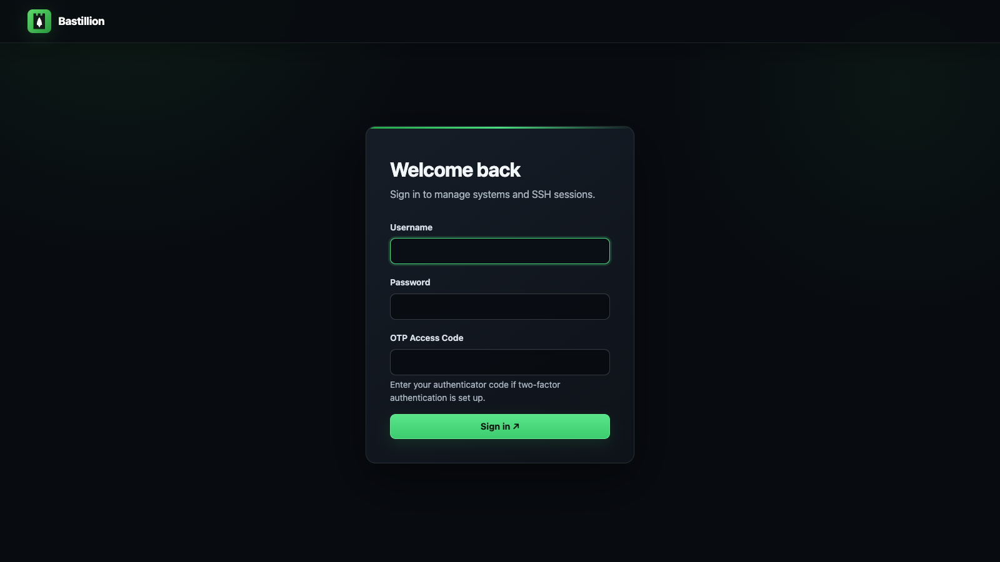

### Two-Factor Setup

Scan the QR code with Authy, Google Authenticator, or another compatible app.

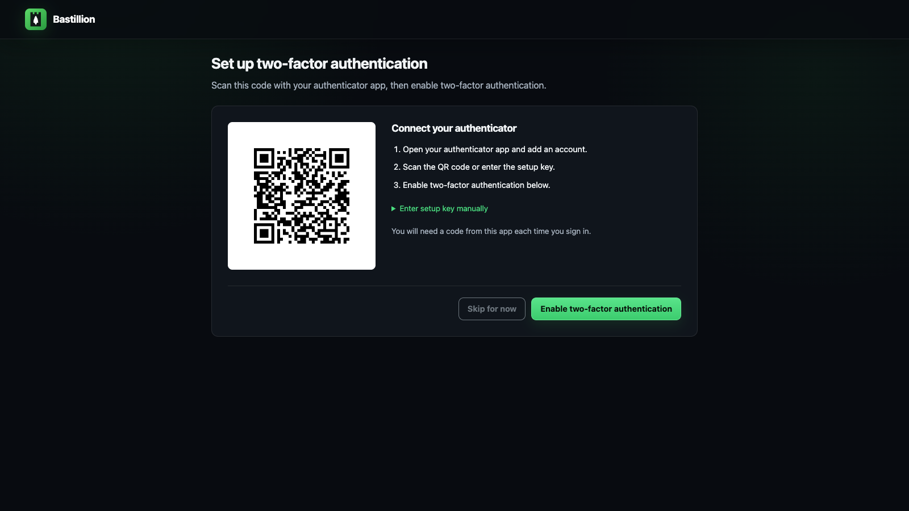

</details>

<details>
<summary><strong>Access Management</strong> — navigation, profiles, and users</summary>

### Main Menu

The available tools are scoped to the signed-in user's permissions.

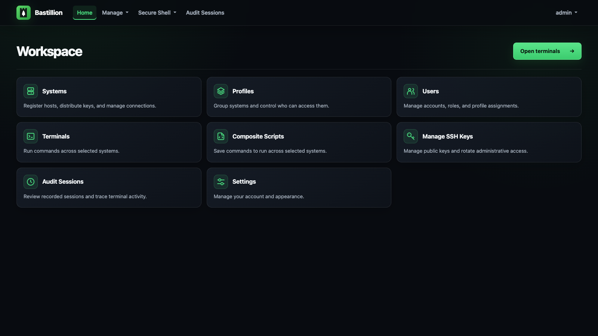

### Manage Profiles

Group systems into named profiles that control access.

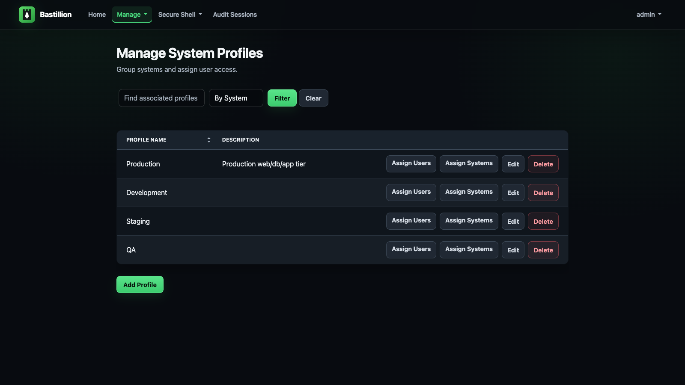

### Manage Users

Create accounts, choose user roles, and grant system access through profiles.

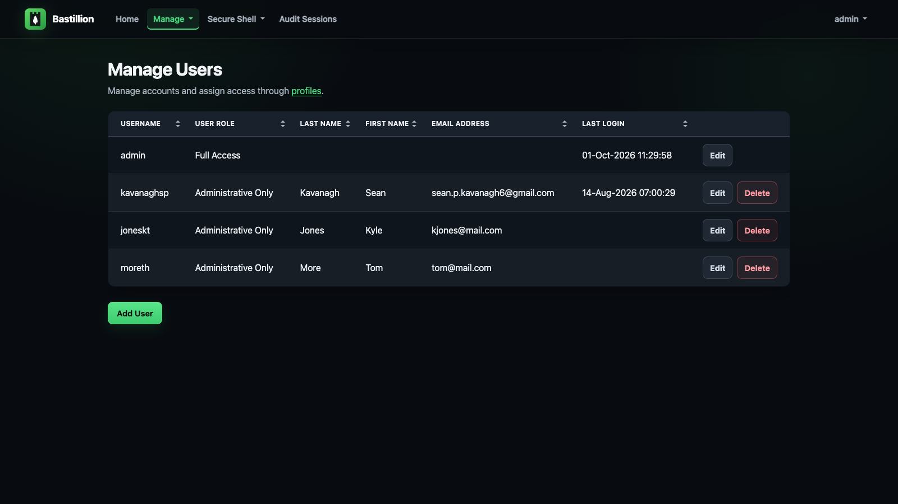

</details>

<details>
<summary><strong>Terminals &amp; Automation</strong> — launch sessions and run saved scripts</summary>

### Terminals

Select one or more systems, optionally filtered by profile, and open them simultaneously.

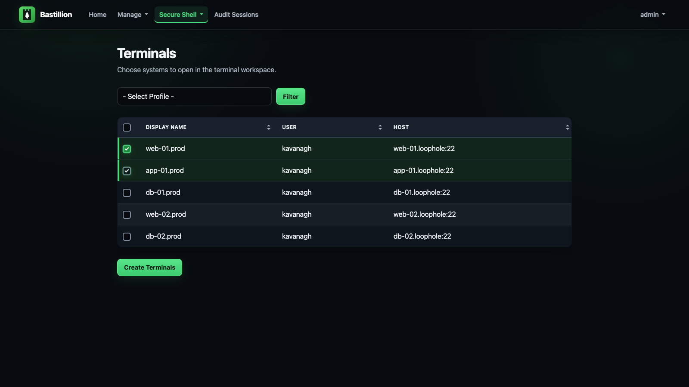

### Composite Scripts

Save a script once and execute it across every selected terminal.

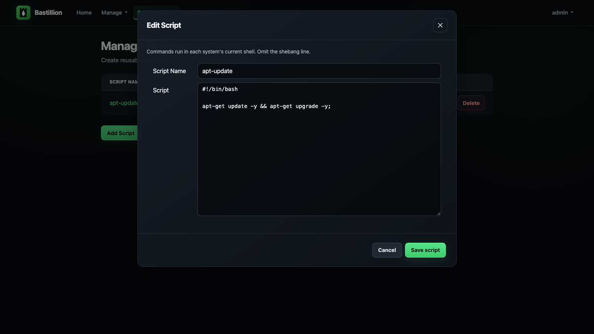

</details>

<details>
<summary><strong>Settings</strong> — account appearance and application authentication</summary>

### User Settings

Change your password, choose the interface and terminal appearance, and manage the public
key Bastillion uses to authenticate to registered systems.

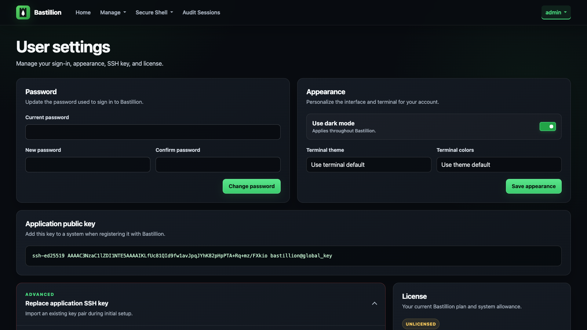

</details>

---

## License

Bastillion is available under the **Prosperity Public License**.

Full list of third-party dependencies and their licenses in [3rdPartyLicenses.md](3rdPartyLicenses.md).

**[Loophole, LLC](https://loophole.company/)** — Sean Kavanagh

[sean@loophole.company](mailto:sean@loophole.company)
